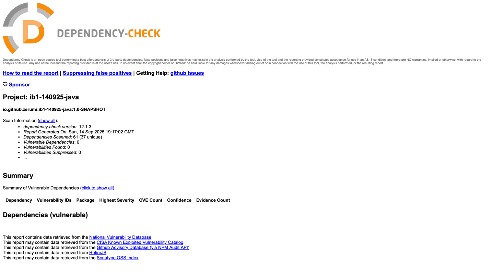

# ib1-140925-java

Information Security Lab #1, ITMO SE (Spring Boot/Java)

---

# Методы API

## 1. `POST /auth/login` — Аутентификация пользователя

**Описание:**
Метод принимает логин и пароль пользователя. В случае успешной аутентификации возвращает JWT-токен.

**Request:**

```http
POST /auth/login
```

```json
{
  "username": "user",
  "password": "password"
}
```

**Response (JSON):**

```json
{
  "accessToken": "eyJhbGciOiJIUzI1NiIsInR5..."
}
```

**Ошибки:**

* `403 Forbidden` — если логин/пароль неверны.

---

## 2. `GET /api/data` — Получение списка аэропортов

**Описание:**
Возвращает список сущностей `Airport`. Доступ только для аутентифицированных пользователей (с валидным JWT).

**Request:**

```http
GET /api/data
Authorization: Bearer <JWT>
```

**Response (JSON):**

```json
[
  {
    "iataCode": "KUF",
    "icaoCode": "UWWW",
    "icaoClassification": "4E",
    "altitude": "n53°30’04’’",
    "latitude": "w050°09’14’’",
    "uprisingMeters": "145",
    "magneticDeclination": "w12°"
  }
]
```

**Ошибки:**

* `403 Forbidden` — если отсутствует или невалиден JWT.

---

## 3. `POST /api/data` — Добавление нового аэропорта

**Описание:**
Добавляет новую сущность `Airport` в список. Доступ только для аутентифицированных пользователей.

**Request:**

```http
POST /api/data
Authorization: Bearer <JWT>
```

```json
{
  "iataCode": "KUF",
  "icaoCode": "UWWW",
  "icaoClassification": "4E",
  "altitude": "n53°30’04’’",
  "latitude": "w050°09’14’’",
  "uprisingMeters": "145",
  "magneticDeclination": "w12°"
}
```

**Response (JSON):**

```json
{
  "iataCode": "KUF",
  "icaoCode": "UWWW",
  "icaoClassification": "4E",
  "altitude": "n53°30’04’’",
  "latitude": "w050°09’14’’",
  "uprisingMeters": "145",
  "magneticDeclination": "w12°"
}
```

**Ошибки:**

* `400 Bad Request` — если данные невалидны.
* `403 Forbidden` — если отсутствует или невалиден JWT.

# Меры защиты

API использует **JWT-токены** для защиты эндпоинтов.

* Пользователь проходит аутентификацию через `POST /auth/login`.
* В ответ получает `accessToken` (JWT).
* Для доступа к защищённым эндпоинтам необходимо передавать токен в заголовке:

```http
Authorization: Bearer <JWT>
```

## Противодействие SQL Injection (SQLi)

* Используется **Spring Data JDBC**, который применяет **параметризованные запросы** → данные подставляются безопасно, без конкатенации SQL-строк.
* Таким образом, классические SQLi невозможны.

## Противодействие XSS

* REST API возвращает **только JSON** и не исполняет JavaScript.
* Устанавливаются заголовки HTTP `X-XSS-Protection`: `1; mode=block` и `Content-Security-Policy`: `script-src 'self'`

## Реализация аутентификации

* Используется **JWT-токен**, который подписывается секретным ключом.
* Токен проверяется middleware (Spring Security `OncePerRequestFilter`).
* Без токена доступ к защищённым эндпоинтам запрещён.

# Скриншот отчета OWASP


